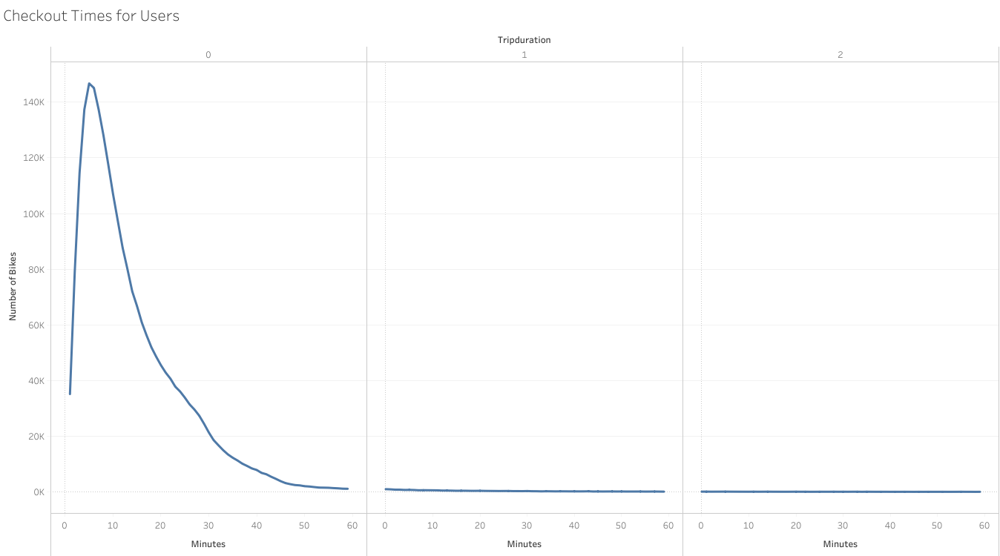
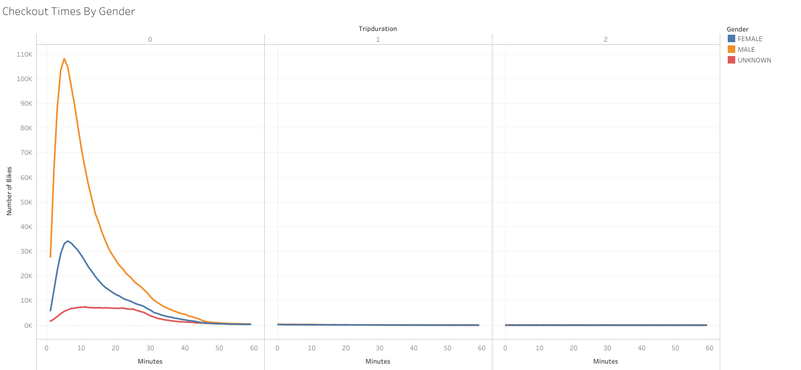
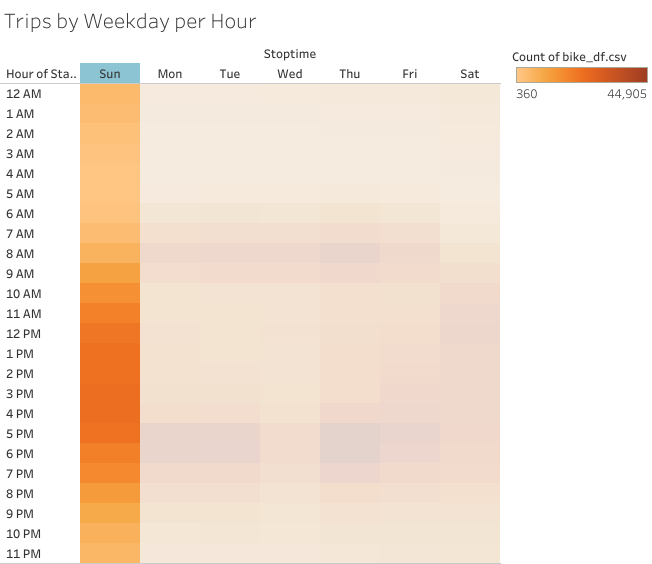
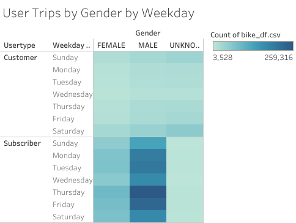
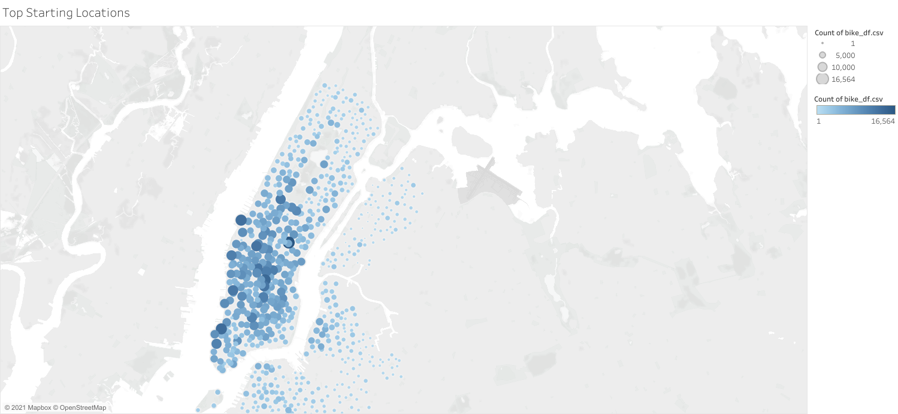
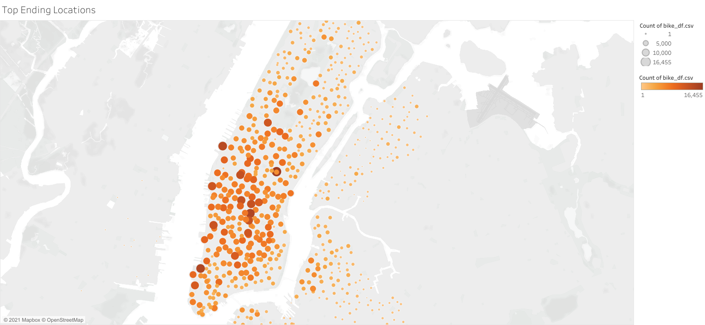

# NYC Citi Bike Analysis
## Link to Tableau, Challenge_Workbook
[link to dashboard](https://public.tableau.com/app/profile/henry.lipscomb/viz/Challenge_Workbook/CitiBikeStory)

## Summary
### Analysis Description
- Our analysis was based on data from the "Citi Bike" bicycle rental network in New York City. We were tasked with gathering information that will help decide whether a simliar business model is viable in Des Moines, Iowa. We learned what types of customers rode the most, where the hotspots are, what days and times are the most popular, and the lenght of a typical rider's trip. 
## Results
### Checkout Times for All Users
- We see in this chart, that ridership peaks at the 5 minute mark, and it quickly tapers off past this peak. At 30 minutes, the ridership is only 14.55% of the peak rate. Charging a base rate per rental with a surcharge for each minute would be advisable since most rentals are relatively short. This base fee could be waived for subscribers, but having monthy cap for rental time might be neccesary.

### Checkout Times by Gender
- The bike checkout times for male and female customers follow a similar pattern. There are significantly more male riders than the female riders. Rental lengths for both male and female peak at 5-6 minutes, this is consistent with the ride times for the whole population. 

### Trips by Weekday Per Hour
- On Weekdays, there is a spike in ridership during typical commute times. This tells us that many customers likely ride the bikes to work and back.
Weekends have a far more even ridership pattern. It does appear Saturday is a more popular biking day than Sunday. Wednesday evening has an unusual dip in commuters,but it is unclear why this is the case.

### Trips by Gender (Weekday Per Hour)
- The trips by female and male riders during each weekday follow the same hourly pattern as that of the general population. Both female and male ridership mirror eachother to a remarkable degree. The male ridership is once again shown to be a larger portion of the customer base than females.
.png)

### User Trips by Gender by Weekday
- This chart drives home the point that male subscribers are the largest portion of the user base. Thursday and Friday are the busiest days for this key demographic. The only filter category that has less subscribers than one-off customers is "unknown" gender, this is likely do to a lack of data for one time users.

### Top Starting Locations
- The top starting locations appear to cluster into hotspots. Its likely these areas have a high concentration of buisinesses and living spaces. It is also likely these areas have bike friendly infrastructure, such as bike lanes and greenways Finding a place in Des Moines with similar amenities will be key.

### Top Ending Locations
- The top ending locations closely mirror the top starting locations, it further reinforces the need to locate a similar hotspot in Des Moines to locate the rental stations.

## Overview
### Overiew Summary
- There are several key takeaways from our research that can be utilized in Des Moines. Subscribers make up a large portion of the customer base, so attracting subscribers and retaining their membership should be a priority. Male ridership is greater than that of female ridership, so this is something to keep in mind when attempting to market the bike rental business. While male riders are a larger segment of the customer population, female ridership is still significant and cannot be overlooked. Since, one time rider numbers fairly low it might make sense to charge a hearty rate for these type of customer. If the pricing for a one time ride was close enough to a monthly subscription cost, it will likely boost the number of subscribers.
### Additional Visualization Ideas
- One idea for a potential additional visualization, would be to add a map layer for housing units or population on the "Top Starting and Ending Locations", if you made a similiar map for Des Moines this could help narrow down the bike station locations. 
- Another visualization that could bear fruit, would be ride length broken down by subscriber vs one time customers. This could help decide optimal pricing models for each customer type. 
- It might be worthwhile to make a map similar to the "Top Starting Location" that can be filtered by the day of the week. Of a series of visualizations for each day. A pattern might emerge that gives us some explanation of Wednesday's dip in riders.

DONT FORGET TABLEAU PUBLIC LINK